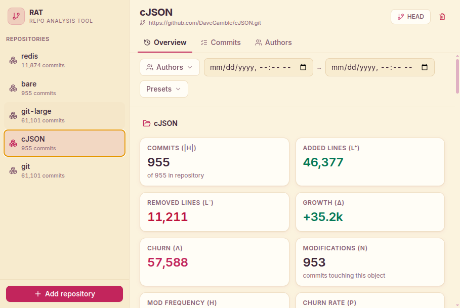
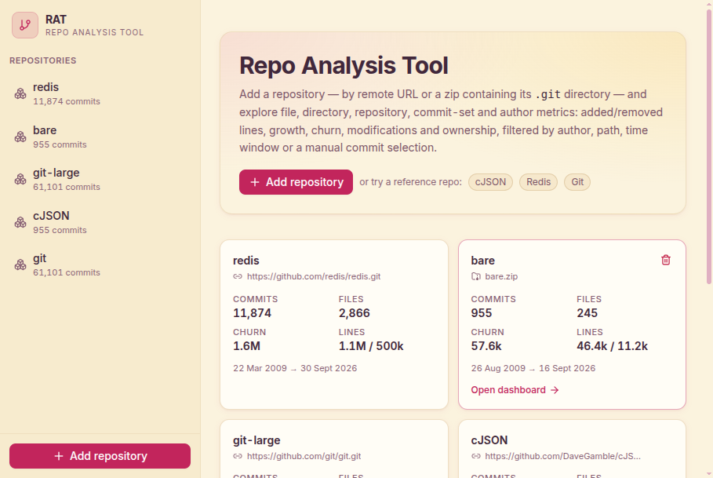
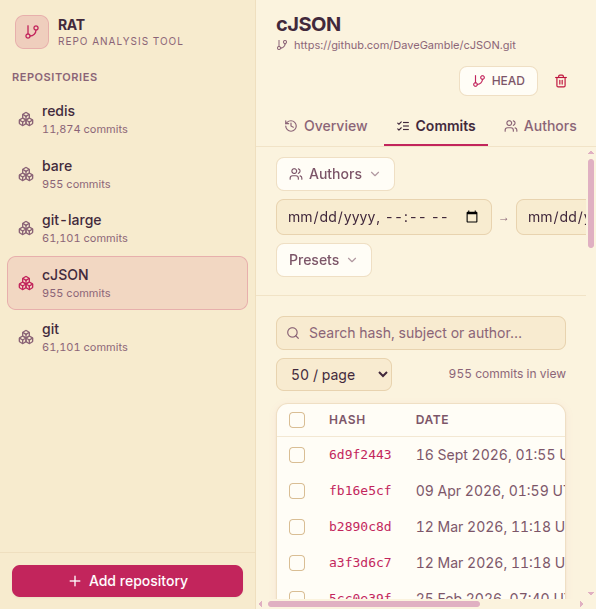
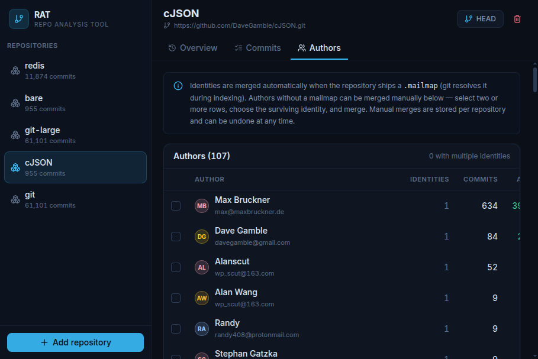
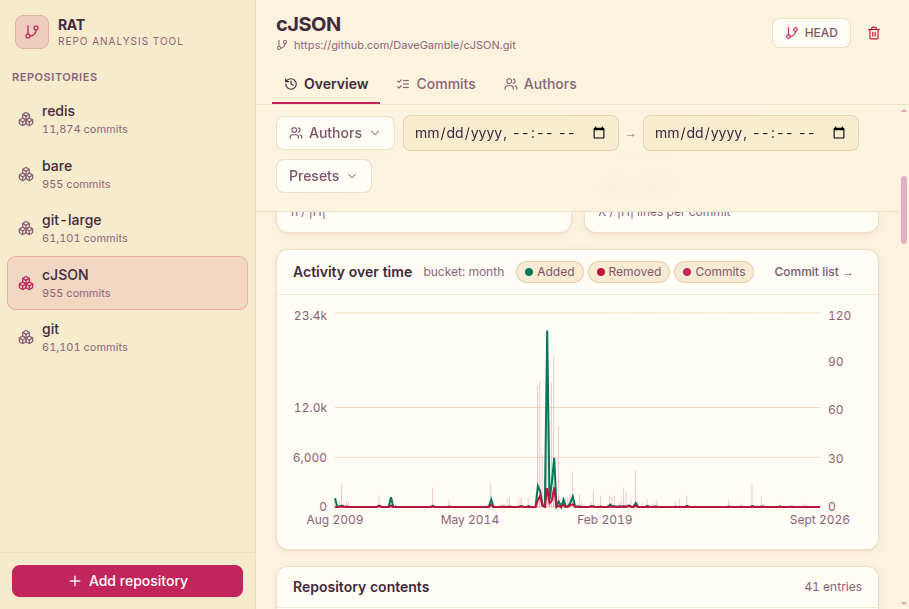
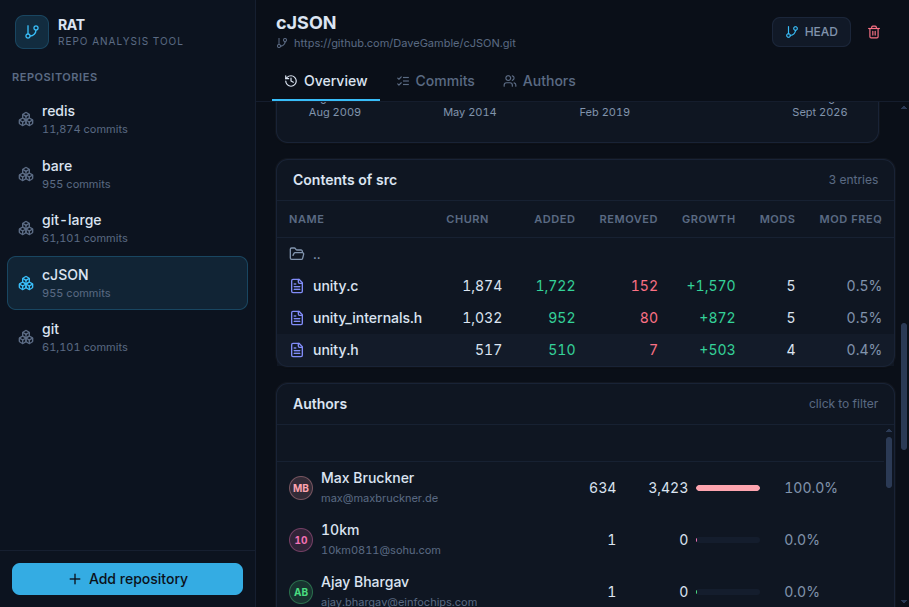

# RAT — Repo Analysis Tool

A web dashboard that makes git repositories transparent: who has impact where, which
parts of a project are the most volatile, and how the codebase evolved over time.
RAT ingests repositories (zip upload or deep clone from a URL), computes the file,
directory, repository, commit-set and author metrics defined in the COMS3011A
specification, and presents them in a filterable multi-repository dashboard.



## Features

- **Repository ingestion, two ways**
  - Upload a **zip** of a repository (with its `.git` directory, or a bare-repo zip)
  - **Clone a remote URL** (http(s), git://, ssh://, scp-style) with full history
  - Ingestion runs as a background job with a live progress log
- **Multiple repositories** live side by side, each with independent state
- **Author merging**
  - Git `.mailmap` support is automatic (resolved at parse time)
  - Manual merging of any identities via the Authors tab, with undo
- **All metric categories** — file, directory, repository (root), commit set and
  author metrics, exactly as specified (see [Metrics](#metrics))
- **Filtering** by repository, author(s), file/directory (click-through navigation),
  a time window (`H_t`, `H_{i,j}`), or a **manually selected list of commits**
- **Reference commit switching** — re-index a repository at any commit hash
- Shareable URLs — the full dashboard state (repo, tab, path, filters) lives in the URL hash

| Home | Commits | Authors |
| --- | --- | --- |
|  |  |  |
| Timeline chart | Directory drill-down | |
|  |  | |

## Quickstart

Requirements: Python 3.11+, Node.js 18+, npm, git.

### One command

```bash
chmod +x start.sh
./start.sh
# → installs deps, builds the frontend, starts the server at http://localhost:8000
```

### Manual steps (equivalent)

```bash
# 1. Backend (FastAPI)
python3 -m venv .venv
source .venv/bin/activate
pip install -r backend/requirements.txt

# 2. Frontend (build once; the backend serves the result)
cd frontend && npm install && npm run build && cd ..

# 3. Run
.venv/bin/python -m uvicorn app.main:app --port 8000 --app-dir backend
# open http://localhost:8000
```

For frontend development with hot reload, also run `npm run dev` inside `frontend/`
(Vite proxies `/api` to `localhost:8000`).

Runtime state (clones, parsed caches, metadata) is kept in `data/` (git-ignored).
Set `RAT_DATA_DIR` to relocate it.

## Architecture

```
browser (React + TypeScript + Tailwind + Recharts)
    │  REST/JSON
    ▼
FastAPI (backend/app/main.py)
    │
    ├─ ingest.py   background jobs: zip extraction (zip-slip safe) / bare clone
    ├─ store.py    repository registry, job queue, persistence, LRU caches
    ├─ gitio.py    one-pass git history parser  ──▶ pickled RepoData per head
    ├─ authors.py  union-find author model + ordered merge ops (undoable)
    └─ metrics.py  metric query engine over the parsed history
```

**Parse once, query many.** `git log --no-merges -M50% --numstat` is executed a
single time per (repository, reference commit); the parsed history — per-commit
file and directory deltas, mailmap-resolved authors — is pickled and reloaded from
cache. Every dashboard query (filters, paths, author breakdowns, timelines) is then
answered by an in-memory aggregation pass, with an LRU cache on top for repeated
queries. Re-indexing at a different reference commit reuses the cached parse when
that head has been seen before.

Key design points:

- **Rename detection at 50%** matches the spec: pure renames contribute nothing;
  rename+modify changes are attributed to the new path. Both rename syntaxes
  (`old => new`, `{a => b}/c`) and C-quoted paths are handled.
- **Binary files** (git's `- -` numstat marker) are excluded everywhere.
- **Directory metrics** are stored as ancestor roll-ups: adding each file delta to
  every ancestor directory (including root) telescopes to the spec's recursive
  immediate-children definition in O(depth) per file.
- **Deletions** surface as removed lines on the deleted path.
- **Author identities** are `(resolved name, email)` pairs from git's mailmap-aware
  `%aN`/`%aE`; manual merges are an ordered list of ops replayed through a
  union-find, so *undo* is just dropping an op and rebuilding.

## Metrics

Per commit *h* and object *o* (file or directory), RAT computes:

| Metric | Definition | Where |
| --- | --- | --- |
| Added / Removed lines | `l⁺ₕ,ₒ`, `l⁻ₕ,ₒ` | metric cards, tables |
| Growth | `δ = l⁺ − l⁻` | metric cards, tables |
| Churn | `λ = l⁺ + l⁻` | metric cards, tables, timeline |
| Modifications | `n = Σ 𝕀(λₕ,ₒ > 0)` over the commit set | metric cards |
| Modification frequency | `η = n / |H|` | metric cards |
| Churn rate | `ρ = λ / |H|` | metric cards |
| Author modifications | `nₕ,ₒ,ₐ` | Authors tab, author panel |
| Author churn | `λₕ,ₒ,ₐ` | Authors tab, author panel |
| Author ownership | `ω = λₕ,ₒ,ₐ / λₕ,ₒ` | author panel bars |

Repository metrics are directory metrics on the root. Commit sets are `H̄` (non-merge
commits reachable from the reference), refined by time window `H_{i,j}`, manual
commit selection, and/or author filter — all freely combinable.

## API overview

| Endpoint | Purpose |
| --- | --- |
| `GET /api/repos` | list repositories (state, head, stats) |
| `POST /api/repos/clone` / `POST /api/repos/upload` | start an ingestion job |
| `GET /api/jobs/{id}` | job progress log |
| `DELETE /api/repos/{id}` | remove a repository |
| `POST /api/repos/{id}/ref` | switch the reference commit |
| `GET/POST /api/repos/{id}/metrics` | all metrics for a filtered query (`path`, `author[]`, `commit[]`, `from_ts`, `to_ts`) |
| `GET/POST /api/repos/{id}/commits` | paginated, searchable commit listing |
| `GET /api/repos/{id}/authors` | author groups + aliases |
| `POST .../authors/merge` / `POST .../authors/unmerge` | manual author merging |

The POST variants exist because large manual commit selections exceed practical URL
lengths; the frontend switches automatically.

## Correctness & testing

```bash
.venv/bin/python -m pytest backend/tests -q        # 40 tests
```

- **Unit + API tests** (`backend/tests/`): fixture repositories built with exact
  timestamps, renames, deletes, binaries, merge commits, a committed `.mailmap`,
  and hand-computed expected values for every metric category, plus end-to-end
  API tests (ingestion both ways, filters, merges, ref switching, persistence
  across restart).
- **Independent validation** against the three provided repositories
  (`scripts/validate_metrics.py`): re-parses `git log` with logic written
  independently of the application parser and compares expected vs. actual values
  for root/file/directory/author/time-window/manual-set/combined queries:

  ```
  python scripts/validate_metrics.py          # after ingesting repos
  ```

  Results on the provided repos: **72/72 checks pass** — cJSON (955 commits,
  zip *and* clone ingestion paths), Redis (11,874), Git (61,101, including a
  6,111-commit manual selection).

## Performance

Measured on this machine (single process, no parallelism):

| Repository | Commits | Index time | Metric query (cold) | Cached |
| --- | --- | --- | --- | --- |
| cJSON | 955 | ~1 s | < 10 ms | < 5 ms |
| Redis | 11,874 | ~4 s | ~30 ms | ~4 ms |
| Git | 61,101 | ~29 s | ~95 ms | ~5 ms |

The dominant cost is the single `git log` pass per head; queries afterwards are
in-memory aggregations over the pickle.

## Rubric mapping

| Criterion | Coverage |
| --- | --- |
| Requirements (50%) | All metric categories implemented and independently validated on cJSON/Redis/Git; **both** zip and URL ingestion; **all of** filtering (repo, author, path, time window, manual commit list), author merging (mailmap + manual, undoable), multi-repo support |
| Architecture & UI (25%) | Parse-once architecture with cached single-pass aggregation (see above); **"Strawberry & Cream" light theme** — pale-yellow surfaces, plum text, pink accents with ≥4.5:1 contrast; metric cards, add/remove/growth area chart with auto-granularity timeline, sortable tables, click-through directory navigation, author ownership bars, live ingestion progress |
| Usability (25%) | Shareable filtered URLs, live job progress + logs, toasts and inline error handling, searchable/paginated commit list with select-all-page, zip-slip and upload validation, keyboard-free flows, good performance on a 61k-commit repository |

## AI Declaration

This project was built with the assistance of an AI coding agent (Qoder). All code
was generated and reviewed interactively; metric definitions and the independent
validation methodology were cross-checked against the COMS3011A specification.
